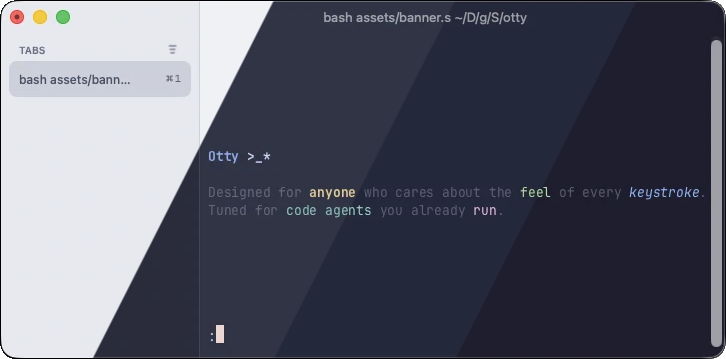
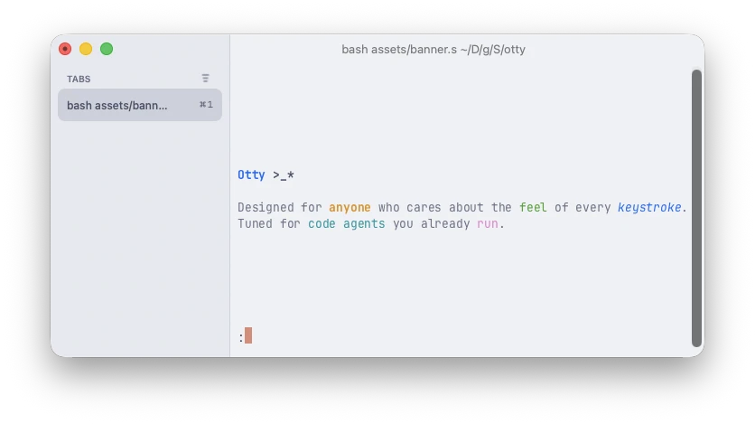
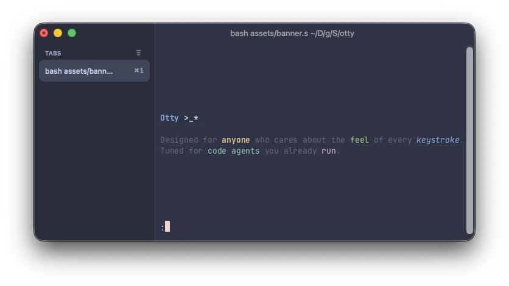
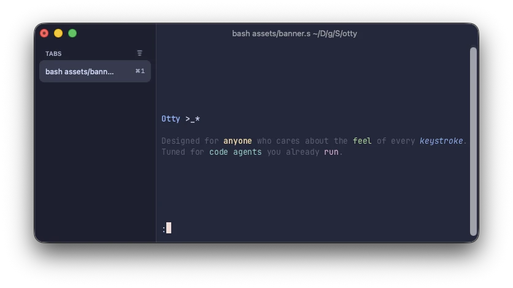
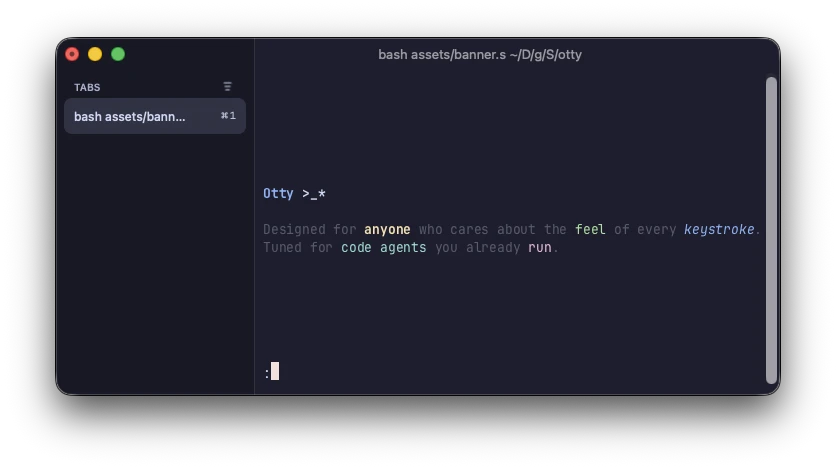

<h3 align="center">
  
 
 Catppuccin for <a href="https://otty.sh/">Otty</a>
 
</h3>

 
 
 

 

## Previews

🌻 Latte

🪴 Frappé

🌺 Macchiato

🌿 Mocha

## Usage

1. Download the flavor of your choice from the [themes](./themes) directory.
2. Open the app's settings and navigate to the "Appearance" tab.
3. Scroll down to the "THEME" section and click **Import Theme...** > **Otty**.
4. Select the downloaded flavor file.

## 💝 Thanks to

- [Suree33](https://github.com/Suree33)

&nbsp;

 

 Copyright &copy; 2021-present <a href="https://github.com/catppuccin" target="_blank">Catppuccin Org</a>

 

